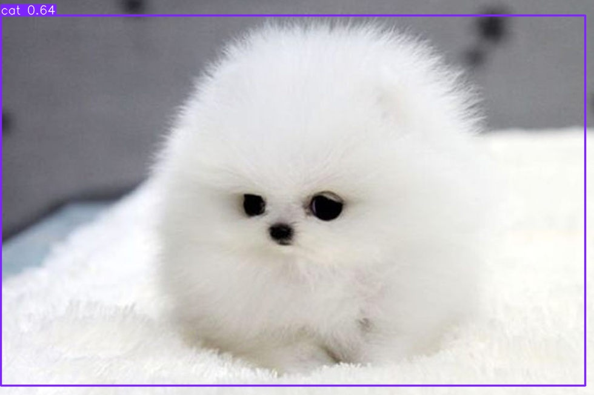

# Real-time Object Detection Comparison

This project provides a side-by-side comparison of two popular object detection models: RTDetr and YOLOv8, running in real-time using your webcam.

## Features

- Real-time object detection using webcam input
- Side-by-side comparison of RTDetr and YOLOv8 models
- Interactive visualization using matplotlib
- Support for CPU and MPS (Apple Silicon) devices

## Prerequisites

- Python 3.8 or higher
- Webcam

## Installation

1. Clone this repository:
   git clone https://github.com/Infatoshi/rt-detr-yolo-compare
   cd rt-detr-yolo-compare

2. Install required packages:
```bash
pip install git+https://github.com/huggingface/transformers torch opencv-python Pillow numpy matplotlib ultralytics
```

3. Download the yolov11n.pt model:
```bash
wget https://github.com/ultralytics/assets/releases/download/v8.3.0/yolov11n.pt
```

## Usage

The project includes three main scripts:

1. bench.py - Runs both models side-by-side for comparison:
   python bench.py

2. yolo.py - Runs only YOLOv8 detection:
   python yolo.py

3. v1.py - Runs only RTDetr detection:
   python v1.py

Press 'q' to quit any of the running scripts.

Also... for a one liner yolo v11 usage. Try `yolo predict model=yolo11n.pt source='assets/fluffy.png'`

## Models Used

- RTDetr: Using the `PekingU/rtdetr_v2_r101vd` model for high accuracy object detection (resnet101 base)
- YOLOv8: Using the `yolov11n.pt` model (nano version) for fast inference

## Performance Notes

- The script automatically detects and uses MPS (Apple Silicon) if available, otherwise falls back to CPU
- RTDetr generally provides high accuracy but may be slower than YOLOv8
- yolov11n (nano) model is optimized for speed while maintaining reasonable accuracy

## Troubleshooting

If you encounter any issues:

1. Ensure your webcam is properly connected and accessible
2. Check if you have sufficient GPU/CPU resources
3. Verify all dependencies are correctly installed
4. Make sure you have proper permissions to access the webcam

## License

[Add your license information here]

## Contributing

[Add contribution guidelines if applicable]
